# ACME TFC Demo Runbook

Demo runbook for the ACME Order Portal — Terraform Cloud multi-cloud provisioning showcase.

## Repositories

| Repo | Team | Purpose |
|---|---|---|
| `terraform-azurerm-static-site` | Platform | Module code, CI quality gate, TFC Private Registry |
| `acme-apps-azure` | Application | Terraform configs consuming the module (dev + staging) |
| `acme-demo-runbook` | Presenter | This runbook — Makefile + demo scripts |

## Prerequisites (fresh machine)

```bash
git clone git@github.com:ngphban00/acme-demo-runbook.git ~/acme-demo-runbook
cd ~/acme-demo-runbook
make setup    # clone repos, tag v1.0.0 baseline in module repo
make check    # verify all tools, tokens, repos, and TFC/GitHub access
make destroy  # destroy any existing Azure resources in dev + staging
make reset    # bring code and registry to demo starting state
```

### Required before `make check` passes

| Requirement | How to set up |
|---|---|
| SSH key `~/.ssh/github-ngphban00` | `ssh-keygen -t ed25519 -f ~/.ssh/github-ngphban00` → add public key to GitHub |
| GitHub PAT `~/.github_token` | Create at https://github.com/settings/tokens (scope: `repo`) → `echo 'ghp_xxx' > ~/.github_token && chmod 600 ~/.github_token` |
| TFC token | `terraform login` |
| Terraform >= 1.7 | https://developer.hashicorp.com/terraform/install |

## Resetting for a clean demo

Run these two commands in order before every demo:

```bash
make destroy  # destroy all Azure resources in dev + staging (auto-applies, no manual approval needed)
make reset    # reset module code to v1.0.0, TFC Registry to v1.0.0 only, app configs to starting state
```

`make destroy` uses the TFC API with `auto-apply: true` override, so staging destroy does **not** require manual approval.

After both commands complete, the environment is in the following state:

| | State |
|---|---|
| TFC Registry | v1.0.0 only |
| acme-apps-azure dev | `version = "~> 1.0"`, `access_tier = "Cool"` |
| acme-apps-azure staging | `version = "1.0.0"`, no `replication_type`/`access_tier` |
| Azure resources | None (destroyed) |

## Demo Flow

Run all commands from `~/acme-demo-runbook`.

| Step | Command | What happens | Demo point |
|---|---|---|---|
| 1 | `make module-publish` | Platform team commits `feat:` to module repo → CI runs quality gate (fmt + validate + terraform test) → CI auto-tags **v1.1.0** → TFC Registry gains new version | Quality gate as code, versioned artifact, zero manual release steps |
| 2 | `make app-upgrade` | dev: `version = "~> 1.0"` → `"~> 1.1"` → push to main → TFC dev auto-apply | Fast feedback loop — push to main, infra follows immediately |
| 3 | `make sentinel-fail` | dev: `access_tier = "Hot"` → push to main → TFC plan passes but **Sentinel hard-fails** | Policy as code — nobody can override hard-mandatory, not even admin |
| 4 | `make sentinel-pass` | dev: `access_tier = "Cool"` → push to main → Sentinel passes → **TFC auto-apply** | TFC runs queued in order — wait for newest run to appear, old FAIL run will still show briefly |
| 5 | `make speculative-dev` | `terraform plan` streams locally, executes on TFC as speculative | CLI preview only — no Apply button on VCS-driven workspaces |
| 6 | `make speculative-staging` | Same speculative plan on staging | Same behavior — to apply, must go through PR |
| 7 | `make pr-staging` | Creates branch `release/staging-vX.Y.Z`, upgrades staging to exact version, pushes, **auto-creates PR via GitHub API** | PR triggers TFC speculative plan as PR check → merge → TFC real plan → **manual Confirm & Apply** in TFC UI |

> **Sentinel tip (step 3→4):** After `make sentinel-pass`, TFC may still display the FAIL run from step 3 — this is the previous run. Refresh and look at the **newest run** in the list; it will PASS and auto-apply.

## Code Promotion Model

There is no single "deploy to staging" command. Promotion is a **deliberate human decision** at each gate.

```mermaid
sequenceDiagram
    actor PT as Platform Team
    participant CI as CI (GitHub Actions)
    participant REG as TFC Registry
    actor AT as App Team
    participant DEV as TFC · Dev
    participant STG as TFC · Staging

    rect rgb(30, 50, 80)
        note over PT,REG: Publish new module version
        PT->>CI: feat: commit → push
        CI->>CI: fmt · validate · terraform test
        CI->>REG: auto-tag vX.Y.0
        REG-->>AT: new version available
    end

    rect rgb(30, 70, 50)
        note over AT,DEV: Consume in dev (no gate)
        AT->>DEV: make app-upgrade · version "~> 1.1"
        DEV->>DEV: plan
        DEV-->>AT: ✅ auto-apply
    end

    rect rgb(80, 50, 30)
        note over AT,STG: Promote to staging (human gate)
        AT->>STG: make pr-staging · PR opened
        STG-->>AT: 👁 speculative plan (PR check)
        AT->>STG: review ok · merge PR
        STG->>STG: real plan
        STG-->>AT: waiting for approval
        AT->>STG: ✅ Confirm & Apply
    end
```



### Why no "push to staging"?

| | Dev | Staging |
|---|---|---|
| Version constraint | `~> 1.1` — accepts any compatible minor | `1.1.0` — exact pin, must be explicit |
| Who decides to upgrade | App team, anytime | App team, via PR review |
| Apply gate | None — auto-apply on merge | Manual — **Confirm & Apply** in TFC UI |
| Purpose | Fast feedback, developer freedom | Simulates production, deliberate change control |

Staging is pinned to an **exact version** because promoting to staging is a conscious decision — not an automatic follow-on from dev. The PR is the paper trail.

## Governance contrast: dev vs staging

| | Dev | Staging |
|---|---|---|
| Auto-apply | ON — merges to main apply immediately | OFF — requires manual approval in TFC UI |
| Sentinel policy | Hot tier blocked (dev cost control) | Hot tier allowed (production-like) |
| Version constraint | `~> 1.1` (minor range, flexible) | `1.1.0` (exact pin, conservative) |
| Apply trigger | Push to main | PR → merge → **Confirm & Apply** |

## All Targets

```
make check               Verify tools, tokens, repos, TFC/GitHub access before demo
make help                List all targets with descriptions
make status              Show git log + module tags for both repos
make setup               Clone repos, tag v1.0.0 baseline (run once on a fresh machine)
make destroy             Destroy all Azure resources in dev + staging
make reset               Reset code, registry, and app configs to demo starting state
make module-publish      Platform team: push new feature → CI quality gate → auto-tag
make app-upgrade         App team: upgrade dev to latest published module version
make sentinel-fail       Set access_tier=Hot on dev → Sentinel FAIL (idempotent)
make sentinel-pass       Revert access_tier=Cool on dev → Sentinel PASS + auto-apply (idempotent)
make speculative-dev     Speculative plan on dev — preview only, cannot apply from CLI
make speculative-staging Speculative plan on staging — preview only, must use PR to apply
make pr-staging          Create PR to upgrade staging → TFC check on PR → manual approve after merge
```

## Key URLs

| | |
|---|---|
| TFC Dev workspace | https://app.terraform.io/app/ngphban/acme-apps-azure-dev/runs |
| TFC Staging workspace | https://app.terraform.io/app/ngphban/acme-apps-azure-staging/runs |
| GitHub Actions (module CI) | https://github.com/ngphban00/terraform-azurerm-static-site/actions |
| TFC Private Registry | https://app.terraform.io/app/ngphban/registry/modules |
| acme-apps-azure PRs | https://github.com/ngphban00/acme-apps-azure/pulls |
