# ACME TFC Demo Runbook

A self-contained demo environment showing Terraform Cloud as an organizational provisioning platform — Private Module Registry, Sentinel policy enforcement, VCS-driven workspaces, OIDC credentials, and multi-team governance across dev and staging.

---

## What You Will Build

```
Platform Team                 App Team                   TFC
─────────────                 ────────                   ───────────────────────
terraform-azurerm-static-site → TFC Private Registry → acme-apps-azure (dev)
        ↓ CI quality gate             ↑ versioned              ↓ auto-apply
     auto-tag vX.Y.0            module source           acme-apps-azure (staging)
                                                               ↓ PR → manual approve
```

Three repositories, two environments, one governance model enforced automatically by TFC.

---

## Repositories

| Repo | Team | Purpose |
|---|---|---|
| `terraform-azurerm-static-site` | Platform | Terraform module, CI quality gate, TFC Private Registry |
| `acme-apps-azure` | Application | Configs consuming the module — dev and staging environments |
| `acme-demo-runbook` | Presenter | This repo — Makefile automation + demo scripts |

---

## Prerequisites

### Tools

| Tool | Install |
|---|---|
| Terraform >= 1.7 | https://developer.hashicorp.com/terraform/install |
| Git | `apt install git` / `brew install git` |
| Python 3 | `apt install python3` / `brew install python3` |
| GitHub CLI (`gh`) | https://cli.github.com |
| `jq` | `apt install jq` / `brew install jq` |

### Accounts

| Account | Notes |
|---|---|
| **GitHub** | Free — you will fork 2 repos |
| **Terraform Cloud** | Free tier at https://app.terraform.io/signup/account |
| **Azure** | Free trial or existing subscription — used for actual provisioning |

---

## One-Time Setup

### Step 1 — Fork the repos

Fork these two repos into your GitHub account:

- `terraform-azurerm-static-site` — the Terraform module
- `acme-apps-azure` — the application configs

Then clone this runbook:

```bash
git clone git@github.com:<your-github-user>/acme-demo-runbook.git ~/acme-demo-runbook
```

### Step 2 — Create a TFC organization

1. Sign in to https://app.terraform.io
2. Create a new organization — e.g. `my-org`
3. Connect a VCS provider: **Settings → VCS Providers → Add a provider → GitHub**

### Step 3 — Create TFC workspaces

Create two workspaces connected to your fork of `acme-apps-azure`:

| Workspace name | VCS branch | Auto-apply | Directory |
|---|---|---|---|
| `acme-apps-azure-dev` | `main` | **ON** | `envs/dev/azure` |
| `acme-apps-azure-staging` | `main` | **OFF** | `envs/staging/azure` |

Both workspaces need **Speculative plans on pull requests** enabled.

### Step 4 — Set up Azure credentials via OIDC

In TFC: **Settings → Variable Sets → Create variable set** named `azure-oidc`.  
Apply it to both workspaces. Add these environment variables:

| Key | Value | Sensitive |
|---|---|---|
| `TFC_AZURE_PROVIDER_AUTH` | `true` | No |
| `TFC_AZURE_RUN_CLIENT_ID` | `<your Azure App Registration client ID>` | No |
| `ARM_SUBSCRIPTION_ID` | `<your Azure subscription ID>` | Yes |
| `ARM_TENANT_ID` | `<your Azure tenant ID>` | Yes |

> No `ARM_CLIENT_SECRET` — TFC uses Workload Identity Federation (OIDC). See [Azure OIDC setup guide](docs/oidc-azure.md).

### Step 5 — Set up Sentinel policy

In TFC: **Settings → Policy Sets → Create policy set**.  
Connect it to your TFC organization (not a specific workspace).  
Add the policy file from `terraform-azurerm-static-site/policies/`.  
Set enforcement level to **hard-mandatory**.

### Step 6 — Configure CI for the module repo

In your fork of `terraform-azurerm-static-site`, add these GitHub Actions secrets:

| Secret | Value |
|---|---|
| `TFE_TOKEN` | A TFC API token with publish rights to your registry |

The CI workflow (`.github/workflows/`) will auto-tag on `feat:` commits and publish to TFC Registry.

### Step 7 — Configure the runbook

Edit the top of `~/acme-demo-runbook/Makefile`:

```makefile
SSH     := GIT_SSH_COMMAND='ssh -i $(HOME)/.ssh/<your-ssh-key> -o StrictHostKeyChecking=no'

TFC_DEV := https://app.terraform.io/app/<your-tfc-org>/acme-apps-azure-dev/runs
TFC_STG := https://app.terraform.io/app/<your-tfc-org>/acme-apps-azure-staging/runs
GH_CI   := https://github.com/<your-github-user>/terraform-azurerm-static-site/actions
GH_APPS := https://github.com/<your-github-user>/acme-apps-azure
```

Also update the `ORG` variable in all `demo-scripts/*.py` files:

```python
ORG = "<your-tfc-org>"
```

### Step 8 — Run initial setup

```bash
cd ~/acme-demo-runbook
make setup    # clone repos, tag v1.0.0 baseline in module repo
make check    # verify all tools, tokens, repos, and TFC/GitHub access
```

`make check` will prompt you for tokens if they are missing:
- GitHub PAT (scope: `repo`) — saved to `~/.github_token`
- TFC token — saved to `~/.terraform.d/credentials.tfrc.json`

---

## Before Every Demo

```bash
make destroy  # destroy all Azure resources in dev + staging
make reset    # reset code and registry to v1.0.0 starting state
```

After both commands, the environment is in this state:

| | State |
|---|---|
| TFC Registry | `v1.0.0` only |
| dev workspace | `version = "~> 1.0"`, `access_tier = "Cool"` |
| staging workspace | `version = "1.0.0"` |
| Azure resources | None (destroyed) |

---

## Demo Flow

Run all commands from `~/acme-demo-runbook`.  
Use `make present` for guided talking points at each step.

| Step | Command | What happens | TFC capability shown |
|---|---|---|---|
| 0 | `make present` | Open presenter teleprompter in a separate terminal | — |
| 1 | `make status-registry` | Show Registry versions and what each env consumes | Private Registry versioning |
| 2 | `make module-publish` | Platform team pushes `feat:` → CI quality gate → auto-tag v1.1.0 → Registry | Quality gate before publish |
| 3 | `make app-upgrade` | Dev upgrades to `~> 1.1` → push → TFC auto-apply | VCS-driven workspace |
| 4 | `make show-credentials` | Prove no Azure creds on local machine — OIDC only | Zero-credential model |
| 5 | `make show-sentinel` | Show policy code with annotations before triggering it | Sentinel explanation |
| 6 | `make sentinel-fail` | Set `access_tier = Hot` → TFC plan passes → **Sentinel hard-fails** | Hard-mandatory enforcement |
| 7 | `make sentinel-pass` | Revert to `Cool` → Sentinel passes → auto-apply | Policy as infrastructure |
| 8 | `make show-audit` | Show immutable run history across both workspaces | Audit trail |
| 9 | `make speculative-dev` | `terraform plan` runs in TFC — read-only, no apply | CLI remote execution |
| 10 | `make pr-staging` | Creates PR → TFC speculative plan appears as PR check | PR check = TFC plan |
| 11 | `make show-pr-plan` | Fetch and display the speculative plan result | Speculative plan details |
| 12 | *(manual)* | Merge PR in GitHub → TFC staging plan → **Confirm & Apply** in TFC UI | Human approval gate |
| 13 | `make show-state` | Show state versions, serial, locking across workspaces | State management |

> **Sentinel tip (step 6 → 7):** After `make sentinel-pass`, TFC may still show the FAIL run from step 6. Refresh and look at the **newest run** — it will PASS and auto-apply.

---

## Code Promotion Model

```mermaid
sequenceDiagram
    actor PT as Platform Team
    participant CI as CI (GitHub Actions)
    participant REG as TFC Registry
    actor AT as App Team
    participant DEV as TFC · Dev
    participant STG as TFC · Staging

    rect rgb(30, 50, 80)
        note over PT,REG: Publish new module version
        PT->>CI: feat: commit → push
        CI->>CI: fmt · validate · terraform test
        CI->>REG: auto-tag vX.Y.0
        REG-->>AT: new version available
    end

    rect rgb(30, 70, 50)
        note over AT,DEV: Consume in dev (no gate)
        AT->>DEV: make app-upgrade · version "~> 1.1"
        DEV->>DEV: plan + Sentinel check
        DEV-->>AT: ✅ auto-apply
    end

    rect rgb(80, 50, 30)
        note over AT,STG: Promote to staging (human gate)
        AT->>STG: make pr-staging · PR opened
        STG-->>AT: 👁 speculative plan on PR
        AT->>STG: review ok · merge PR
        STG->>STG: real plan + Sentinel check
        STG-->>AT: waiting for approval
        AT->>STG: ✅ Confirm & Apply
    end
```



### Governance contrast: dev vs staging

| | Dev | Staging |
|---|---|---|
| Auto-apply | ON — merges apply immediately | OFF — requires manual Confirm & Apply |
| Sentinel | Hot tier blocked (cost control) | Hot tier allowed (production-like) |
| Version constraint | `~> 1.1` — accepts minor patches | `1.1.0` — exact pin, explicit promotion |
| Apply trigger | Push to main | PR → merge → human approval |

---

## All Targets

```
make present             Guided presenter teleprompter — talking points at each step
make check               Verify tools, tokens, repos, TFC/GitHub access before demo
make setup               Clone repos, tag v1.0.0 baseline (run once on fresh machine)
make help                List all targets with descriptions
make status              Show git log and module tags for all repos
make status-registry     Show TFC Registry versions and what each env consumes
make show-sentinel       Explain Sentinel policy with annotations before triggering
make show-credentials    Prove no Azure credentials on local machine — OIDC model
make show-audit          Show immutable run history across both workspaces
make show-pr-plan        Fetch and display the latest speculative plan on staging
make show-state          Show state versions, serial, locking — vs S3+DynamoDB
make module-publish      Platform team: push feature → CI quality gate → auto-tag
make app-upgrade         App team: upgrade dev to latest published module version
make sentinel-fail       Set access_tier=Hot on dev → Sentinel hard-fail
make sentinel-pass       Revert access_tier=Cool on dev → Sentinel pass + auto-apply
make speculative-dev     Speculative plan on dev — preview only, no apply
make speculative-staging Speculative plan on staging — preview only, must use PR
make pr-staging          Create PR to promote staging → TFC check → manual approve
make destroy             Destroy all Azure resources in dev + staging
make reset               Reset code and registry to demo starting state (v1.0.0)
```

---

## Troubleshooting

**`make module-publish` says "nothing to commit"**  
Module already patched — run `make reset` first to restore baseline.

**`make sentinel-pass` exits with Error 1**  
Sentinel already passing — idempotency check caught it. Check TFC dev workspace for current state.

**`make pr-staging` fails with "non-fast-forward"**  
Old branch still on remote — the script force-pushes automatically. If it still fails, delete the remote branch manually: `git push origin --delete release/staging-vX.Y.Z`.

**TFC plan shows wrong module version**  
Registry may have extra versions from a previous demo run. Run `make reset` to clean up.

**`make check` fails on TFC token**  
Run `terraform login` or paste token when prompted by `make check`.
